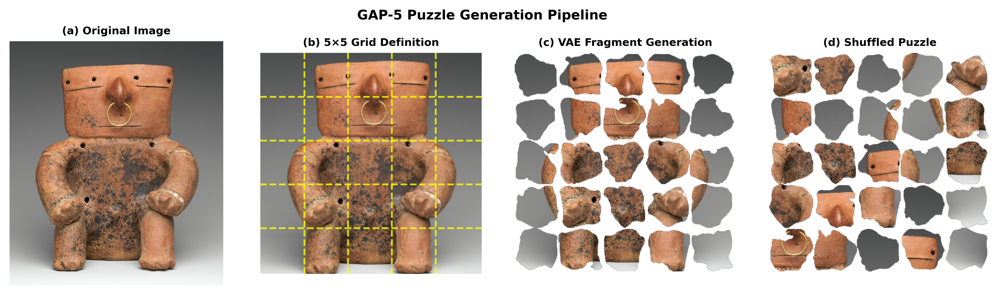
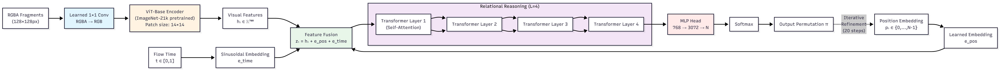

<p align="center">
  <strong>Ofir Itzhak Shahar &nbsp;·&nbsp; Gur Elkin &nbsp;·&nbsp; Ohad Ben-Shahar</strong><br/>
  <a href="https://icvl.cs.bgu.ac.il/">ICVL Lab, Ben-Gurion University of the Negev</a>
</p>

<p align="center">
  <a href="https://arxiv.org/abs/2605.12077"></a>
  <a href="https://huggingface.co/datasets/Ofirish/GAP"></a>
  <a href="https://github.com/icvl-bgu/puzzle-flow-matching"></a>
</p>

## Overview

We bridge the gap between simplified academic jigsaw benchmarks and real archaeological reconstruction with two contributions:

1. **GAP** — large-scale benchmarks (GAP-3, GAP-5; 20,000 puzzles each) of irregular, eroded fragments produced by a VAE trained on real archaeological pieces from the RePAIR dataset.
2. **PuzzleFlow** — a ViT + discrete flow-matching framework that solves jigsaw puzzles with arbitrary fragment geometries via holistic relational reasoning across whole pieces.

## GAP Datasets

<p align="center">
  
</p>

| Variant | Grid | Pieces | Canvas | Train / Val / Test |
|---|---|---|---|---|
| **GAP-3** | 3×3 | 9 | 384×384 | 14,000 / 3,000 / 3,000 |
| **GAP-5** | 5×5 | 25 | 640×640 | 14,000 / 3,000 / 3,000 |

🔗 **Dataset, fragment-generation VAE weights, and generation code:** [huggingface.co/datasets/Ofirish/GAP](https://huggingface.co/datasets/Ofirish/GAP)

## PuzzleFlow

<p align="center">
  
</p>

PuzzleFlow formulates puzzle reassembly as **permutation learning via discrete flow matching**. A pretrained ViT-Base encodes each fragment (with a learned RGBA→RGB projection that preserves the irregular alpha-mask shape information), task-specific transformer layers perform cross-piece relational reasoning, and an iterative flow-matching procedure refines a random permutation into the predicted assembly.

## Results on GAP

| Method | GAP-3 PA / AA / SRA | GAP-5 PA / AA / SRA |
|---|---|---|
| Greedy (Pomeranz et al.) | 0.0 / 11.6 / 8.6 | 0.0 / 4.1 / 3.7 |
| GA (Sholomon et al.) | 0.0 / 11.1 / 8.5 | 0.0 / 11.1 / 8.5 |
| JigsawGAN | 4.6 / 45.3 / 35.9 | 0.0 / 18.0 / 12.0 |
| DiffAssemble | 16.4 / 50.5 / 43.4 | 0.0 / 21.9 / 14.7 |
| FCViT | 25.2 / 60.7 / 47.6 | 0.0 / 20.4 / 13.8 |
| **PuzzleFlow (ours)** | **28.5 / 62.9 / 55.7** | **0.3 / 29.1 / 19.8** |

## Citation

```bibtex
@article{shahar2026missing,
  title={The Missing GAP: From Solving Square Jigsaw Puzzles to Handling Real World Archaeological Fragments},
  author={Shahar, Ofir Itzhak and Elkin, Gur and Ben-Shahar, Ohad},
  journal={arXiv preprint arXiv:2605.12077},
  year={2026}
}
```

The citation above will be replaced with the official CVPR 2026 reference once available.

## Acknowledgements

This research was conducted at the [ICVL Lab](https://icvl.cs.bgu.ac.il/) at Ben-Gurion University of the Negev, led by Prof. Ohad Ben-Shahar. We thank The Metropolitan Museum of Art for the CC0 image collection and the authors of the RePAIR dataset for their archaeological fragment data.
